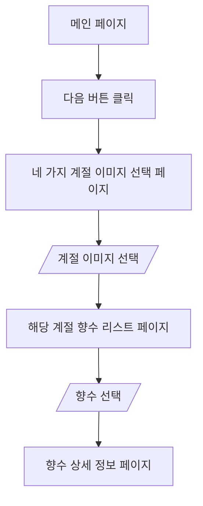

# 향수 추천 사이트 개발

## 개요

- 네 가지의 이미지중 원하는 이미지를 선택하면 해당하는 향수 리스트가 나옴
- 그중 원하는 향수를 누르면 향수에 대한 상세 설명이 나타남

## 디렉터리 구조

```
├── src
│   ├── components - 컴포넌트들을 넣는 폴더
│   ├── pages - 페이지들을 넣는 폴더
│   │   ├── ImageSelectPage.js - 4가지 계절 이미지중 하나를 선택하는 페이지
│   │   ├── MainPage.js - 시작 페이지
│   │   ├── PerfumeDetailPage.js - 향수 상세 정보 페이지 (향수를 선택했을 때 보여주는 페이지)
│   │   ├── PerfumesPage.js - 향수 리스트 페이지
│   ├── assets - 이미지, 폰트, 스타일, 목업 데이터를 넣는 폴더
│   │   ├── fonts - 폰트
│   │   ├── images - 이미지
│   │   ├── mockdata - 목업 데이터 (샘플 데이터)
│   │   ├── styles - css파일
```

## 프로젝트 구조

- components 폴더에 컴포넌트 단위의 파일을 넣음. 예) 다음 버튼, 계절 선택 버튼등
- pages 폴더에 각 페이지 파일을 넣음. 예) 메인페이지, 향수 리스트 페이지등
- 이미지는 images 폴더에 넣음.
- mockdata에는 테스트를 위한 샘플 데이터를 넣음. 예) 향수들

## 프로젝트 플로우차트



## 자동 서식 적용 안 될때

1. Ctrl + , 또는 **Cmd + ,**를 눌러 설정창 열기.
2. json을 검색하고 왼쪽 디렉토리에서 json을 선택
3. settings.json에서 편집을 선택
4. 아래 코드 추가

```
{
  "editor.defaultFormatter": "esbenp.prettier-vscode",
  "editor.formatOnSave": true,
  "editor.codeActionsOnSave": {
    "source.fixAll.eslint": true
  },
  "eslint.alwaysShowStatus": true
}

```
